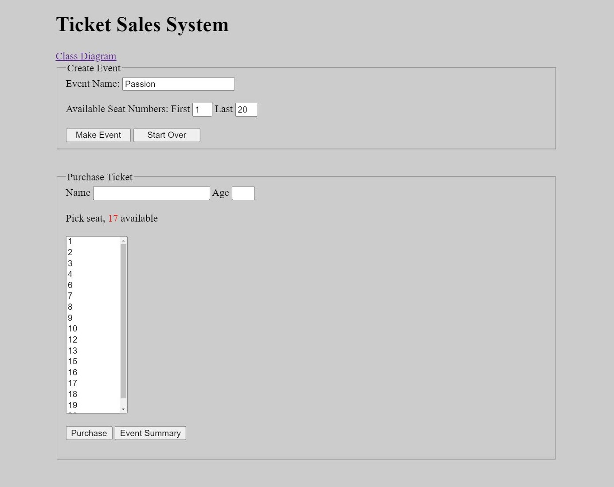
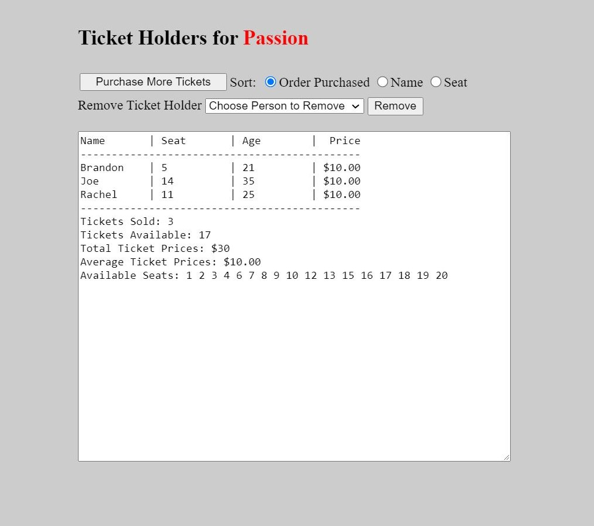

# Ticket Sales System (2022)

Ticket sales system allows a user to create and purchase tickets for an event (concert, etc. anything with assigned seating) and displays a summary page that shows all the tickets that have been sold with their corresponding information. Summary page allows sorting, removing, or purchasing more tickets. System utilizes state management.
 
 

 

